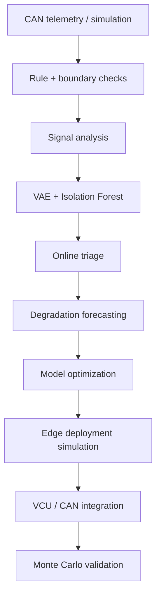

# Autonomous Battery Sentinel

**Simulation-first AI telemetry and fault-analysis pipeline for Formula SAE battery / vehicle systems.**

Autonomous Battery Sentinel explores an end-to-end architecture that moves from raw CAN-style telemetry through anomaly detection and degradation forecasting toward edge-oriented triage and VCU integration.

> Engineering prototype. Hardware fail-safe behavior and competition compliance require validation on the actual vehicle and rule set; this repository alone does not establish production or safety certification.

## Architecture map



## Pipeline

The repository's `main.py` orchestrates the same stages shown above, allowing them to run independently or as a full sequence.

## Techniques represented in the codebase

- CAN-style telemetry simulation and preprocessing
- Kalman filtering and fuzzy / probabilistic analysis
- VAE + Isolation Forest anomaly detection
- Online triage logic
- Physics-informed / sequence-model degradation experiments
- Quantization, pruning, and distillation experiments
- Jetson-oriented deployment logic
- ROS 2 / CANopen-facing VCU integration code
- Monte Carlo validation utilities

## Repository artifacts

The repository includes training / analyzed telemetry datasets, validation utilities, model artifacts, an orchestration script, and a separate `SCRIPT_EXPLAINER.md` describing individual modules.

## Running the pipeline

Inspect available stages:

```bash
python main.py --help
```

Example:

```bash
python main.py --simulate --compliance
```

Run the full configured sequence:

```bash
python main.py --all
```

## Design goal

The project asks a systems question: **how much battery-health reasoning can be pushed onto the vehicle itself so that telemetry analysis remains useful without depending on cloud inference?**

That leads naturally to three constraints:

1. Models need to be small and fast enough for edge hardware.
2. Detection must interact with explicit engineering rules rather than replace them.
3. Any automated action needs a conservative, testable interface to vehicle control.

## Validation boundary

Several modules simulate deployment, faults, or fail-safe behavior. Those simulations are useful for architecture development, but they are not equivalent to hardware-in-the-loop, track, or safety certification.

A production path would require at minimum:

- hardware-in-the-loop testing;
- sensor / CAN fault injection;
- timing and resource profiling on the target edge device;
- validation against the current competition rulebook;
- independent safety review;
- deterministic fallback behavior outside the ML path.

## Status

Research / engineering prototype focused on the intersection of **time-series ML, edge inference, vehicle telemetry, and safety-aware control architecture**.